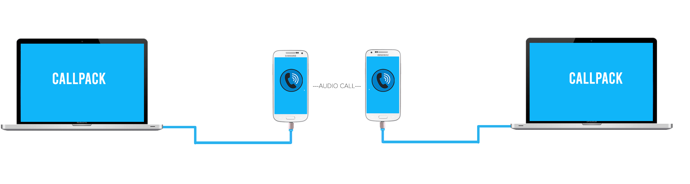

# CallPACK

Share your internet with your friend without Internet? , Introducing CallPACK a dial-up implementation where both parties can send an receive data through GSM voice calls.

# What it is?
So CallPACK is basically a dailup connection that works on your soundcard instead of using a dedicated modem like that where used in the early ages.Both the recipent and sender is connected together via audio calls.Where packets are sent over as modulated frequencies.




Theoretically with a soundcard capable of a sample rate 48khz we can achieve upto 100kbps with this method.
But in this case we have dailed down the sampling rate to 8khz ,dail up the settings if you want to increase the transer speed.


# Advantages:
- While on disasters when there is no internet available due to less signal coverage, In these conditions quality of phone calls still doesn't deteriorate.

 - Quick share video files and stuff across a group of people by conferencing calling people in GSM.
 
 - Quick sharing of a work you did by yourself to the company 

- Super secure as there is no internet involved in the transportation.

# Cons:
- Low speed
- Noise over channels may lead in packet loss.


# Implementation

This a FSK implementation done via softmodems and transmitted across **GSM mobiles**

## Author
- thesun_Rider
- Arjun KV
- Kaveri A
- Salih

## Credits
The FSK library is from <https://github.com/darksidelemm/alltheFSKs> Hats off to him.

```
Created as a part of FOSS United HACKATHON!! Thanks guys for the stage!
```
